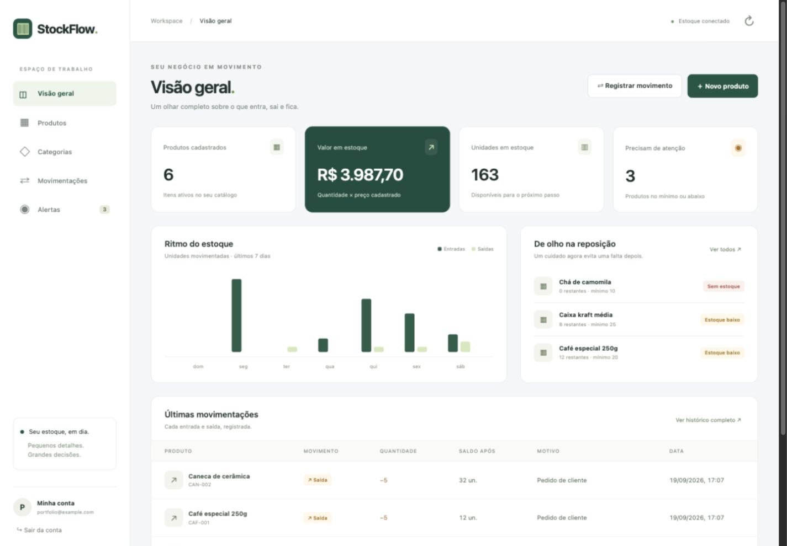

# StockFlow

**Seu estoque em perfeito equilíbrio.** Sistema de gestão de estoque para pequenos negócios, desenvolvido como projeto de portfólio para Workana, com Java 21, Spring Boot e Supabase.



## Recursos

- Cadastro de conta, login por e-mail/senha, renovação de sessão e logout.
- Dashboard com produtos ativos, unidades, valor em estoque, gráfico semanal e alertas.
- Cadastro, edição e exclusão lógica de produtos; SKU único por conta.
- Categorias com cadastro, edição e exclusão quando não há produtos vinculados.
- Entradas e saídas com quantidade, motivo, data, saldo resultante e histórico preservado.
- Bloqueio de saldo negativo, atualização transacional e prevenção de lançamentos duplicados em reenvios da mesma requisição.
- Estoque mínimo, avisos de reposição, busca por nome/SKU e filtros por categoria, status, tipo e período.
- Tabelas paginadas, interface responsiva em português e estados de carregamento, erro e lista vazia.
- Dados separados por conta, com Row Level Security e autorização nas funções SQL.

## Executar em 5 passos

> **Neste computador, o Supabase já está configurado.** Abra `http://localhost:8080` enquanto a aplicação estiver rodando. Para reabrir, execute `iniciar.command`. Veja [o registro da configuração](docs/SUPABASE-CONFIGURADO.md). Os passos abaixo continuam válidos para instalar em outro ambiente.

### 1. Pré-requisitos

Instale **JDK 21** e **Maven 3.9+**. Alternativamente, use Docker e Docker Compose. Crie um projeto no [Supabase](https://supabase.com/dashboard).

### 2. Preparar o Supabase

1. Abra o **SQL Editor** do projeto.
2. Execute todo o arquivo [`supabase/migrations/001_stockflow.sql`](supabase/migrations/001_stockflow.sql) **uma única vez**, em um projeto novo. O script roda em uma transação; um erro desfaz a migração.
3. Em **Authentication → Providers**, habilite e-mail e senha. Mantenha a confirmação de e-mail habilitada para uso público.
4. Em **Authentication → URL Configuration**, configure `http://localhost:8080` como **Site URL** e URL de redirecionamento permitida. Em produção, substitua pela URL HTTPS do aplicativo.
5. Obtenha a **Project URL** e a chave **publishable** (`sb_publishable_...`) ou a chave **anon** legada na seção de API do projeto.
6. Mantenha `public` como schema exposto na Data API, com limite de resultados de **pelo menos 500** (o padrão de 1.000 atende).

**Não use chaves `service_role` ou `sb_secret_...`.** Elas têm privilégios que o aplicativo não precisa. A chave do projeto é usada pelo Java; as consultas autenticadas usam também o JWT individual do usuário.

### 3. Configurar o ambiente

Na pasta do projeto:

```sh
cp .env.example .env
```

Preencha `.env` com os valores do seu projeto. O Spring Boot lê esse arquivo a partir do **diretório de execução**. Não use aspas nos valores. Variáveis de ambiente do sistema têm precedência.

```properties
SUPABASE_URL=https://SEU_PROJETO.supabase.co
SUPABASE_ANON_KEY=SUA_CHAVE_PUBLISHABLE_OU_ANON
PORT=8080
COOKIE_SECURE=false
```

`.env` está excluído do Git e do contexto de build Docker. Nenhuma chave real é fornecida neste repositório.

### 4. Iniciar

```sh
mvn spring-boot:run
```

Abra **http://localhost:8080**. Ou use:

```sh
docker compose up --build
```

Para gerar e executar o pacote Java:

```sh
mvn clean verify
java -jar target/stockflow-1.0.0.jar
```

### 5. Criar a conta e usar

Clique em **Cadastre-se**, informe seu e-mail e uma senha de 8 a 128 caracteres. Confirme o e-mail e depois entre com suas credenciais. O link de confirmação retorna à tela de login; o aplicativo não depende dos tokens presentes no link.

Crie categorias e produtos. Cada produto começa com saldo zero. Registre uma **entrada** para informar o estoque inicial e use **saídas** para vendas ou ajustes. O saldo só muda por movimentações.

Se o envio de e-mail não chegar, verifique spam, limites de envio e a configuração SMTP no Supabase. Em projetos públicos, configure seu próprio provedor SMTP. Para desenvolvimento, também é possível criar um usuário confirmado pelo painel do Supabase. Não desative a confirmação para um ambiente público.

## Estrutura

```text
stockflow/
├── src/main/java/com/stockflow/
│   ├── auth/        # Login, cadastro, sessão e renovação de tokens
│   ├── config/      # Segurança, CSRF, cabeçalhos e proteção da API
│   ├── inventory/   # Controllers, DTOs validados e serviço de estoque
│   ├── shared/      # Respostas de erro
│   └── supabase/    # Cliente HTTP de integração
├── src/main/resources/
│   ├── application.yml
│   └── static/      # HTML, CSS e JavaScript sem build de frontend
├── src/test/java/   # Testes da API e autenticação
├── supabase/
│   ├── migrations/  # Tabelas, índices, RLS e funções transacionais
│   └── tests/       # Testes SQL com PostgreSQL embarcado (PGlite)
├── tests/          # Testes de navegador e servidor fictício de teste
├── docs/           # Arquitetura, API, validação e texto de portfólio
├── .env.example
├── Dockerfile
├── compose.yaml
└── pom.xml
```

## Arquitetura e regras

O navegador acessa o backend Java na mesma origem. O Java mantém os tokens Supabase na sessão do servidor e entrega apenas um cookie de sessão `HttpOnly` e `SameSite=Strict`. O cliente não grava JWT em `localStorage`. As escritas exigem CSRF, inclusive login e logout.

O Java envia o token do usuário ao Supabase. RLS filtra leituras. Escritas diretas nas tabelas não são concedidas a `authenticated`: passam por funções SQL com `search_path` fixo e verificação explícita de `auth.uid()`. A função de movimentação bloqueia a linha do produto, valida o saldo e registra o histórico na mesma transação. A chave de idempotência evita duplicação ao repetir o mesmo lançamento.

- **Um estoque por conta.** Não há equipe compartilhada, papéis de administrador ou múltiplos depósitos nesta versão.
- **Exclusão lógica.** Produtos com saldo diferente de zero não podem ser excluídos. Ao excluir, o histórico permanece e o SKU fica reservado. A categoria é desvinculada.
- **Histórico imutável pelo aplicativo.** Corrija erros com uma movimentação inversa e um motivo claro.
- **Alerta:** quantidade menor ou igual ao mínimo. Saldo zero tem status próprio.
- **Valor em estoque:** saldo × preço unitário informado. Não representa lucro nem avaliação contábil por custo médio.
- Quantidades inteiras; preços com duas casas decimais. Datas são armazenadas em UTC e exibidas no fuso do navegador.

Veja os detalhes em [`docs/ARCHITECTURE.md`](docs/ARCHITECTURE.md) e os endpoints em [`docs/API.md`](docs/API.md).

## Testes

Os testes Java não exigem credenciais nem conexão real com o Supabase:

```sh
mvn verify
```

Para testar as regras SQL, instale **Node.js 22+**. Node só é necessário para estas ferramentas de teste:

```sh
npm ci
npm run check
npm run test:db
```

Os testes de banco executam a migração real em PGlite (PostgreSQL embarcado), simulando o schema de autenticação do Supabase. Cobrem saldo, isolamento entre contas, idempotência, permissões, validação e exclusão com histórico. PGlite usa uma conexão; o teste de duas saídas não substitui teste de concorrência com conexões independentes no Supabase.

Para a suíte de navegador:

```sh
mvn package
npx playwright install chromium
npm run test:e2e
```

Deixe as portas **18080** e **54329** livres. A suíte inicia o Java e um servidor Supabase **fictício, local**, com banco descartável. Não requer `.env` real. As credenciais de teste no código só existem nesse servidor. As capturas geradas em `docs/` usam dados fictícios.

Veja [`docs/VALIDATION.md`](docs/VALIDATION.md) para os testes efetivamente executados e suas limitações.

## Publicação

Para publicar o backend Java na Vercel com contêiner e sessões compartilhadas, siga [docs/DEPLOY.md](docs/DEPLOY.md).

Use HTTPS e `COOKIE_SECURE=true`. Configure a URL pública no Supabase e injete as variáveis de ambiente pela plataforma de hospedagem. O container roda sem privilégios de root. No perfil local, as sessões ficam na memória e reiniciar exige novo login. No perfil `vercel`, o armazenamento compartilhado no Supabase mantém sessões entre instâncias; aplique a migração 002 e configure o segredo conforme o guia de publicação.

Este projeto atende uma demonstração profissional e catálogos pequenos. A interface consulta dados em lotes de 500 e calcula indicadores/filtros no navegador. Para catálogos grandes, migre agregações, busca e paginação para consultas no servidor. Alertas são visuais, atualizados ao carregar ou clicar em atualizar; não há notificações por e-mail nem sincronização em tempo real.

A aplicação ainda não foi publicada na internet. O projeto Supabase desta instalação local já foi configurado; consulte o registro acima. Valide o cadastro com e-mail real antes de disponibilizar uma demonstração pública.

## Apresentação na Workana

Use [`docs/PORTFOLIO.md`](docs/PORTFOLIO.md) como base de descrição e roteiro de demonstração. Apresente como **projeto autoral de portfólio**, sem atribuir clientes ou resultados comerciais não comprovados.

## Referências

- [Spring Boot: requisitos](https://docs.spring.io/spring-boot/3.5/system-requirements.html)
- [Supabase Auth](https://supabase.com/docs/guides/auth)
- [Supabase Data API](https://supabase.com/docs/guides/api)
- [Row Level Security](https://supabase.com/docs/guides/database/postgres/row-level-security)
